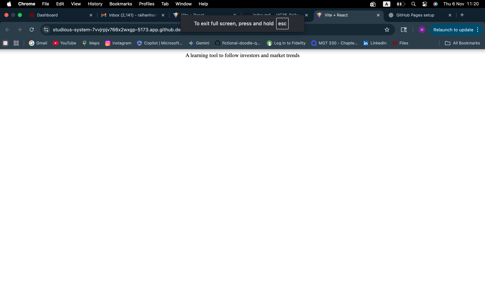
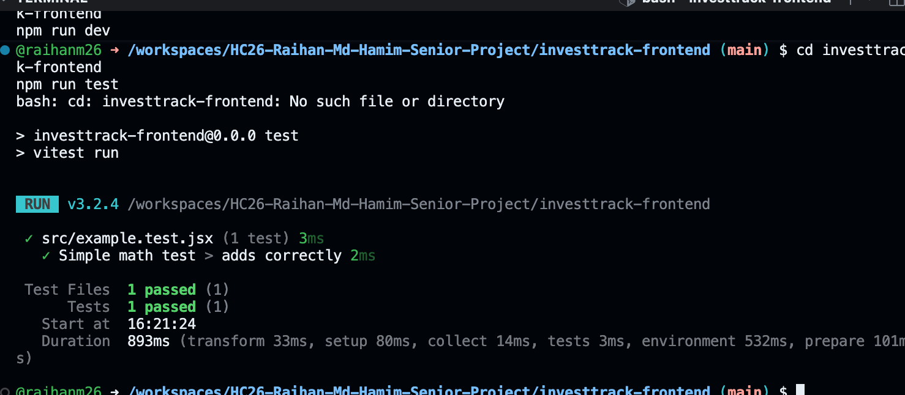

---

####  02-tests.md
```markdown
---
layout: default
title: Step 2 - Add and Run Tests
---

# Step 2: Add and Run Tests

We’ll use [Vitest](https://vitest.dev/) for testing.

## Write a Test
Inside `src/example.test.jsx`, add:

```jsx
import { test, expect } from 'vitest';

test('adds numbers correctly', () => {
  expect(2 + 3).toBe(5);
});
```


[← Previous: Setup](01-setup.md) | [Next → CI with GitHub Actions](03-ci.md)


